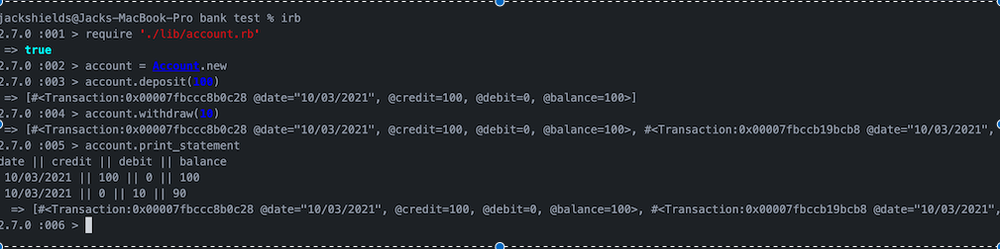

# bank-tech-test

Bank tech test

Today, you'll practice doing a tech test.

For most tech tests, you'll essentially have unlimited time. This practice session is about producing the best code you can when there is a minimal time pressure.

You'll get to practice your OO design and TDD skills.

You'll work alone, and you'll also review your own code so you can practice reflecting on and improving your own work.

Specification

Requirements

- You should be able to interact with your code via a REPL like IRB or the JavaScript console. (You don't need to implement a command line interface that takes input from STDIN.)
- Deposits, withdrawal.
- Account statement (date, amount, balance) printing.
- Data can be kept in memory (it doesn't need to be stored to a database or anything).

Acceptance criteria

- Given a client makes a deposit of 1000 on 10-01-2012
- And a deposit of 2000 on 13-01-2012
- And a withdrawal of 500 on 14-01-2012
- When she prints her bank statement
- Then she would see

date || credit || debit || balance
14/01/2012 || || 500.00 || 2500.00
13/01/2012 || 2000.00 || || 3000.00
10/01/2012 || 1000.00 || || 1000.00

----------------------------------

My Approach

User stories:

As a users
So I can keep my money safe
I want to be able to deposit money into an Account

As a user
So I can see how much money I have
I want to be able to see my balance

As a user
So I can use my money
I want to be able to withdraw my money

As a user
SO I can track my money
I want to be able to see dates on activity

As a user
So I can see everything on one summary
I would like a bank statement.

Class for Account:
- one bank account can have many bank statements.

- hash with list of       transactions = { "01/2/21" => +100, "02/2/21" => -100 }
- balance in initialise

- deposit method

- withdraw method

- both the above with date stamps

Class for statement:
- require bank account

- will need transactions hash, balance
- display transactions method
- display bank statement method.

First user story:
As a users
So I can keep my money safe
I want to be able to deposit money into an Account

- create a account class
- create a balance method
- create default balance with 0
- create initialize method with balance
- create a deposit method.

All above with corresponding tests.

Second user story:
As a user
So I can see how much money I have
I want to be able to see my balance

- see above, test pass due to deposit needing balance method.

Third User story:
As a user
So I can use my money
I want to be able to withdraw my money

- add in withdraw method and test

Fourth User story:
As a user
So I can track my money
I want to be able to see dates on activity

- add in date constant into a string for withdraw and deposit.

Fifth User story:
As a user
So I can see everything on one summary
I would like a bank statement.

- added a statement Class
- add in a transactions constant with array to store transactions in account.
- add in method for print_statement that will take transactions info and format
into statement view.

Whilst trying to create a statement class that would allow statement to be called
I found it difficult and after some time decided another approach would help.

This involved going through and redesigning the app to have more classes and this
gave greater clarity for myself and also split the responsibilities across classes.

I created a transaction class which provided more clarity and format to the data.

How to USE:

- Clone repo
- run `bundle install`
- run `rspec --init`

To run the tests you need to run `rspec`

To run the app follow the demo below in the command line IRB.

IRB DEMO:

